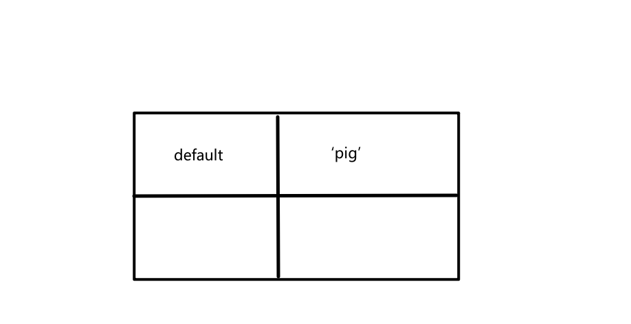
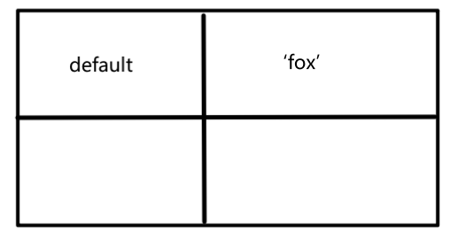
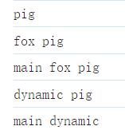

# 浏览器中 ESM 的模块工作原理

## 1、ES Module

ES modules 是原生 JavaScript 提供的模块功能，现在几乎所有的浏览器都支持了 ES Module 方式，比如 Vite 就是利用了这一点。Vite 不会像 Webpack 一样，将代码降级成 ES5，然后再将多个模块打包在一起，交给浏览器运行。而是直接将代码推送给浏览器运行，当浏览器遇到 import 语句时，再去加载对应的模块，这也就是我们在开发环境中为什么用 Vite 启动项目比 Webpack 快的原因。

ES Module 通过 import 关键字和 export 关键字进行模块的导入与导出。每个模块的**作用域独立**，变量不会相互污染。

## 2 、浏览器中是怎么执行 ESM 的？

我们用以下的例子来进行讲解：

### 2.1 解析

首先，对于 index.html：

```js
<body>
    <script type="module" src="./main.js"></script>
</body>
```

浏览器执行到 script 标签时，做的第一件事就是模块的解析。（注意：是解析，而不是运行！）解析的第一步就是补全 URL 地址，因为我们写的 URL 是一个相对路径，浏览器会将相对路径**补全**为一个绝对路径（包括协议、域名、端口号等等）。然后**进行模块的下载**，下载之后，就会拿到 main.js 的代码了，接着对 main.js 进行解析：

```js
import fox from './fox.js'

import('./dynamic.js').then(n => {
    console.log('main', n.default);
})

console.log('main', fox, pig);

import pig from './pig.js'
```

解析 main.js 的第一步，浏览器会找到 main.js 中所有的顶级静态导入语句（顶级：全局作用域下的），也就是 fox 和 pig，那么浏览器就会将这两行导入语句给提升到全局作用域的最顶部：

```js
import fox from './fox.js'
import pig from './pig.js'

import('./dynamic.js').then(n => {
    console.log('main', n.default);
})

console.log('main', fox, pig);
```

所以，我们在书写代码的时候，应该自己就把 import 语句书写在最顶部，书写在中间或者尾部其实是错误的，只不过浏览器有纠错的功能，帮我们纠正过来了而已。

浏览器将顶级静态导入语句提升的目的就是，获取到所有的导入语句，并进一步对这些导入语句解析，也就是 **URL 地址补全 + 静态解析**。等这两个 js 代码下载完成，同样会进入这两个代码文件中，进行**递归**的解析。

首先会解析 fox.js

```js
// fox.js
import pig from './pig.js'

console.log('fox',pig);

export default 'fox'
```

浏览器对 fox.js 进行解析时发现，pig.js 其实已经下载过了，或者是正在下载中，那么它不会去重复的执行下载。

```js
// pig.js
console.log('pig');

export default 'pig'
```

可以发现，pig.js 中没有依赖其他的模块，那么当前阶段的**解析就结束了**。

### 2.2 模块执行

在这个过程中，浏览器才会真正的去执行代码。首先回到入口文件进行执行，执行的过程就是从上到下执行每一行代码。

对于 main.js：

```js
import fox from './fox.js'
import pig from './pig.js'

import('./dynamic.js').then(n => {
    console.log('main', n.default);
})

console.log('main', fox, pig);
```

执行 main.js 的第一行代码，由于第一行代码是链接到 fox.js ，那么就进入到 fox.js 里面的代码：

```js
import pig from './pig.js'

console.log('fox',pig);

export default 'fox'
```

执行 fox.js 的第一行代码，由于第一行代码是链接到 pig.js ，那么就进入到 pig.js 里面的代码：

```js
console.log('pig');

export default 'pig'
```

执行 pig.js 的代码，打印了语句 'pig'，执行完成之后，会默认导出一个字符串 'pig'

浏览器对于导出语句的处理，是通过生成映射表的防抖来进行的。具体来说，就是在内存中，针对 pig.js 开辟了一个表格，用来记录这个模块它导出了什么：



用表格记录的目的是为了**缓存**，将来如果还有别的模块中再依赖了这个模块，那么就不用再执行这个模块了，直接来内存中的这个表格中取值就可以了。

此时 pig.js 就运行完成了，运行完成之后，回到 fox.js 中去，继续执行

```js
import pig from './pig.js'
```

此时需要报 pig.js 默认导出的东西放到我们指定的 pig 变量里面，这个过程**不是简单的赋值**，而是叫做**符号绑定**。具体来说，pig.js 表格中的 default 和我们这个标识符 pig，指向了内存中的同一块空间。这种现象在整个 JS 中都是绝无仅有的。

导入语句执行完成，下面执行 log 语句，打印出 `fox pig`

之后执行导出语句，形成一个表格：



然后再回到 main.js ，执行：

```js
import pig from './pig.js'
```

由于 pig.js 已经解析执行过了，那么就可以直接向内存表中拿到执行后的结果 `pig` 而不用再执行 pig.js 了。

接下来向下执行，准备执行动态导入语句：

```js
import('./dynamic.js').then(n => {
    console.log('main', n.default);
})
```

可以发现，动态导入是在执行过程中进行处理的，而静态导入是在解析过程中进行处理的。对于动态的导入，依然是先解析得到完整的 URL 地址，然后再下载模块代码。这里要注意的是，这个模块的下载是**异步的**，JS 并不会等待这个下载的过程，而是直接继续向后执行代码，执行到 log 语句，打印出 `main fox pig`。

等待 dynamic.js 下载完成之后，开始执行 dynamic.js：

```js
import pig from './pig.js'

console.log('dynamic',pig);

export default 'dynamic'
```

由于 pig 已经执行过了，直接去内存表中取值，不会重新执行

接着执行 log，打印出 `dynamic pig`，再导出 'dynamic'，同样是新建一个映射表来存储。

接着回到 main.js ，import 语句完成，得到一个 promise，执行then方法：

```js
import('./dynamic.js').then(n => {
    console.log('main', n.default);
})
```

拿到的 n 其实就是 dynamic 的映射表，打印映射表中的 default，也就是字符串 'dynamic'。所以 log 语句打印出 `main dynamic`。

综上所述，我们得到的输出为：

```js
pig
fox pig
main fox pig
dynamic pig
main dynamic
```

执行检查：



和我们的分析完全一致，这就是 ESM 模块化在浏览器中的执行原理~

总结：

1. 解析：**补全绝对路径**，**下载** JS 文件、提升**顶级静态导入语句**
2. 执行：**递归**执行，每个模块执行后都会用一个**映射表**来保存模块导出的结果，下次再依赖该模块就不用再次执行这个模块了。
3. 动态导入：动态导入只有在执行到这一行代码时，才会开始模块的解析，也就是下载模块。下载的过程是**异步**的，JS会先去执行其他的代码。


