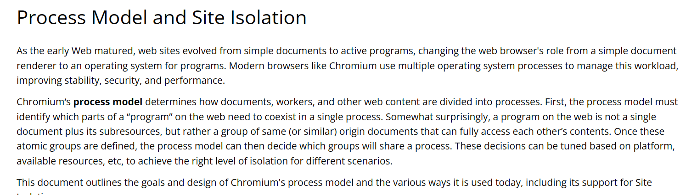

# 浏览器中的事件循环

## 1. 进程与线程

**进程**：每个程序在运行时，在内存空间中拥有一段自己专属的内存空间，用于存放程序的代码、运行中产生的数据以及一个执行任务的**主线程**。这个内存空间就被成为进程。

**线程**：线程是操作系统调度的最小单位，他被包含于进程之中，是进程实际运作单位。线程是任务调度和执行的基本单位

**进程和线程的区别**：

1. 进程是操作系统**资源分配**的基本单位，而线程是**任务调度和执行**的基本单位
2. 进程拥有独立的内存和资源，**线程不拥有空间**，同一个进程中的所有线程共享该进程的空间和资源。
3. 进程本身不能运行，进程是线程的容器。线程不能单独执行，必须组成进程。
4. 线程更加轻量级，线程间切换开销较小；进程间切换开销较大。

## 2. 浏览器中的进程与线程

首先，浏览器是**多进程**的（不是多线程）。

现代浏览器的构造及其复杂，完全不亚于操作系统。必须由多个进程合作，才能完成浏览器的基本任务。为了避免程序互相影响，减少连环崩溃的几率，当我们启动浏览器之后，会自动启动多个进程。

其中，有三个主要的进程：

1. **浏览器进程**：浏览器进程是最先被启动的进程，主要负责**浏览器界面的显示**（不是页面）、**用户交互**、**子进程的管理**等等。浏览器进程内部会有不同的线程来处理这些不同的任务。
2. **网络进程**：网络进程负责**加载网络资源**，网络进程内部会启动做个线程来处理不同的网络任务。
3. **渲染进程**：渲染进程启动后，会自动开启一个**渲染主线程**，渲染主线程负责执行 HTML、CSS、JavaScript 代码。在默认情况下，一个标签页对应一个渲染进程，这样可以保证各个标签之间相互不受影响。比如一个标签页的渲染主线程阻塞了，其他页面的渲染主线程依然会正常执行。

**PS**：谷歌官方目前正在寻求改变 “一标签页一个渲染进程” 的这种模式，转而在 Windows、Mac 等系统上执行 “一站点一渲染进程”的策略，但目前还未开始具体实施。详见谷歌官方：[Chromium Docs - Process Model and Site Isolation (googlesource.com)](https://chromium.googlesource.com/chromium/src/+/main/docs/process_model_and_site_isolation.md)（需要科学上网）。

## 3. 渲染主线程

渲染主线程负责执行 JavaScript、CSS、HTML 代码，是浏览器中最繁忙的线程，它需要处理大量的任务，包括但不限于：

1. 解析 HTML
2. 解析 CSS
3. 计算元素样式
4. 进行页面布局
5. 处理图层
6. 重新绘制页面（根据 FPS 每秒绘制几次页面）
7. 执行 JS 代码
8. 执行事件处理函数
9. 执行计时器的回调函数

​	......

几乎所有的前端代码，都需要在渲染主线程中执行。所以，渲染主线程的时间必须得到最大程度的利用，所以，这就需要我们进行合理的任务调度。

渲染主线程的任务调度策略简单来说就是两个字：**排队**

例如：当渲染主线程正在执行代码，而用户点击了按钮，我们需要执行按钮的回调，怎么办？或是此时有定时器到时间了，需要执行定时器的回调，怎么办？需要立即暂停主线程的代码吗？

所以，主线程采取了排队的方式来进行任务的调度。在主线程执行一个同步任务的过程中，产生的其他所有任务，都会被加入到叫做 “**消息队列**” 的队列中去排队，等待主线程执行完当前的任务之后，再去消息队列中检查是否有任务。如果有，则取走队首的任务，开始执行；若没有，则渲染主线程进入休眠状态，等待任务。

## 4. 什么是异步？

在了解事件循环之前，我们还要了解到底什么是异步？

首先，我们必须说明一点，JS 是一个单线程的语言。为什么说他是一个单线程的语言？因为 JS 是运行在浏览器的渲染主线程中的，而当前浏览器一个标签页对应一个渲染进程，也就是对应一个渲染主线程，所以，只有一个线程在执行 JS 的代码。

对于渲染主线程，如果 JS 采取同步的方式的话，那么在执行定时器、网络请求的之类的任务时候，就需要等待任务执行完成才能继续向下进行，会阻塞进程。比如网络请求，采取同步的方式的话，即使后面还有很多代码需要执行，渲染主线程也会等待当前网络请求完成之后，才会执行后续代码。那么再等待网络请求的这段时间，渲染进程实际上是空闲的（阻塞）。而我们之前说到过，渲染主线程是浏览器中最繁忙的进程！如此浪费时间去等待一个任务，简直是暴殄天物！

所以，浏览器采取了异步的方式来避免这些问题。当渲染主线程执行到那些需要满足一定条件再执行回调的函数时，渲染主线程会将其交给其他线程去进行监听，主线程会继续向下执行其他的代码。当回调函数的条件被满足时，其他线程会将回调函数包装为一个任务，添加到消息队列的末尾，等待渲染主线程的调用。

这种异步的机制，可以保证渲染主线程的时间得到最大限度的利用，保证了 JS 即使在单线程的情况下，也能流畅运行。

## 5. JS 为何会阻塞页面的渲染呢？

很简单，我们一个 tab 页只有一个线程在执行 JS、HTML、CSS 代码，而执行 JS 代码需要时间，那么在 JS 代码执行完成之前，主线程是没有办法处理其他任务的。其他任务可能就包括：重新绘制页面、解析 HTML/CSS 等。所以 JS 会阻塞页面的加载和渲染。

## 6. 浏览器中的事件循环

**事件循环的过程**：

1. 在最开始的时候，渲染主线程会进入一个**无限循环**（源码里面就是开启了一个 for 循环）
2. 每一次循环的时候，渲染主线程都会检查消息队列中是否存在任务，如果存在，则加载一个任务到主线程执行；如果没有就进入**休眠**状态。
3. 其他线程可以随时向消息队列中添加任务，新添加的任务只能放在消息队列的末尾。如果添加任务是主线程处于休眠状态，则**唤醒**渲染主线程继续执行任务。

这样的循环就叫做事件循环，又被叫做消息循环。

但是，还有个问题，难道这些任务没有优先级吗？我们之前不是听说过微任务优先级比宏任务高吗？

其实，微任务比宏任务优先级高这个说法并不准确。首先，现代浏览器中并不太区分宏任务这个概念了；其次，任务本身是不具有优先级的，而是不同的消息队列有不同的优先级。

关于消息队列，一个消息队列当然是无法处理如此复杂的任务调度场景的。我们之前听说的宏任务和微任务队列，也是远远不够的。随着现代浏览器处理异步的场景越来越复杂，W3C 官方已经**废除了宏任务队列**的说法了。

在目前的谷歌浏览器的实现中，**至少**包含以下三种队列：

1. **微队列**：存放需要最快被执行的一些任务，优先级在所有队列中**最高**。比如：promise.then、MutationObserver 等微任务
2. **交互队列**：存放由用户操作产生的一些任务，优先级**较高**。
3. **延时队列**：用于存放计时器的回调任务，优先级**中等**。

一般来说，渲染主线程会优先去**高优先级**的队列中获取任务，如果高优先级队列为空，才回去较低优先级队列中取任务。但具体情况不一定如此，可能有变化。

V8 引擎源码地址：[v8/v8: The official mirror of the V8 Git repository (github.com)](https://github.com/v8/v8)

