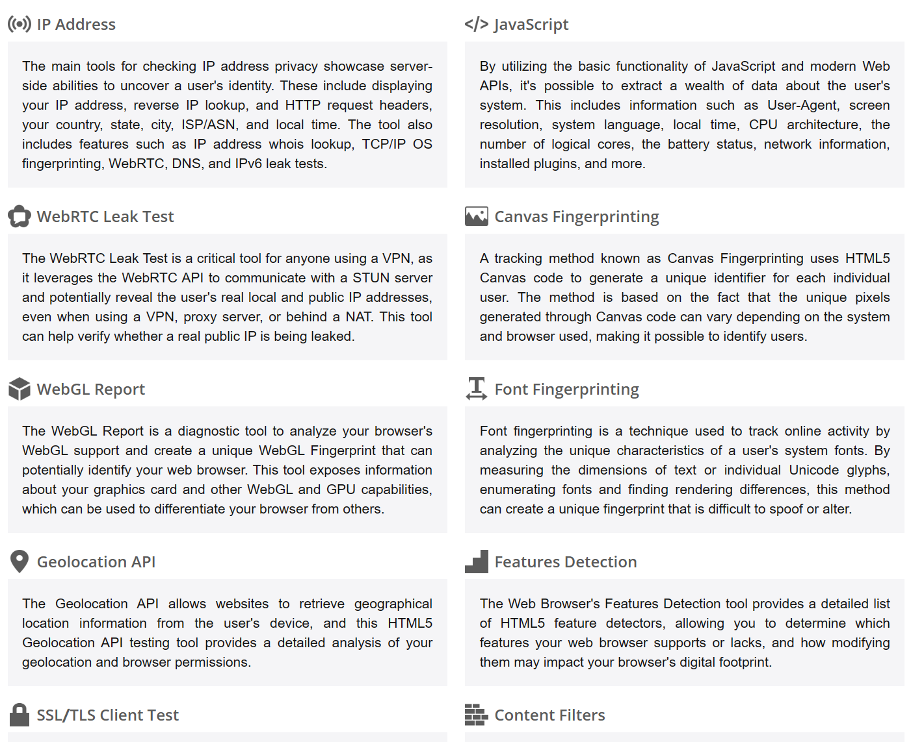
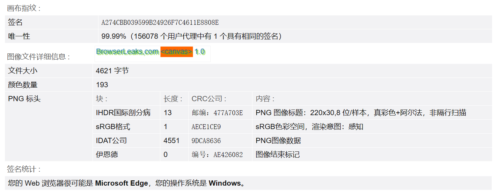

# 浏览器指纹

**浏览器指纹**（ Browser Fingerprinting）是一种前端技术，他可以在用户未登录的状态下，仍然能够区分不同的用户。比如我们登录了网站 A，然后关闭窗口，重新打开一个 “无痕窗口”，进入 A 网站。此时即使我们没有登录，A 网站仍然有可能识别出我们的就是刚才登录过的那个用户。

这就得益于浏览器指纹技术，尽管这个技术侵犯了用户的隐私，但还是有很多公司在大量使用这个技术。

## 1、浏览器指纹为什么能区分不同点用户？

浏览器指纹基于这样一种理念：世界上几乎不存在两个完全一样的浏览器环境。在一个客户端上，有很多信息：

比如：

1. IP 地址
2. JavaScript 的全套 API：不同环境下，浏览器不同、js的版本不同、操作系统不同，导致 JS 的 API 或多或少会有一定的差异
3. Canvas：当我们在 canvas 上面绘图时，即使是使用相同的 API 绘制了同样的图形，也会有一些差异。

在[画布指纹识别 - BrowserLeaks](https://browserleaks.com/canvas#how-does-it-work)上我们可以查看当前浏览器环境基于 canvas 生成的 canvas 指纹：

可以看到，基于我们当前浏览器环境生成的 canvas 指纹，就是那个字符串。根据我们当前的canvas 环境，甚至可以推算出我们的**Web 浏览器很可能是 Microsoft Edge，操作系统是 Windows！**。且这个指纹的唯一性达到了 99.99%。这仅仅是 canvas 指纹的唯一性，如果配合上其它指纹，几乎完全准确的判断出未登录状态下的相同用户。

即使我们打开无痕窗口，可以发现， canvas 指纹也是没有变化的。

## 2、浏览器指纹的应用

1. 用作访客登录。在用户未登录的情况下，识别相同的访客。
2. 网络安全：比如防刷。通过识别浏览器指纹，分辨出多次请求是否来源于同一个用户。
3. 广告：广告公司可以与其他网站合作，获取用户的浏览器指纹，已经在网站上的活动。比如用户在 A 网站查看了房价，被 A 网站记录下了指纹以及浏览内容，提供给了广告公司。那么下次用户进入其他网站时，就可能因为浏览器指纹被识别出来，从而定向的向用户推送购房广告。