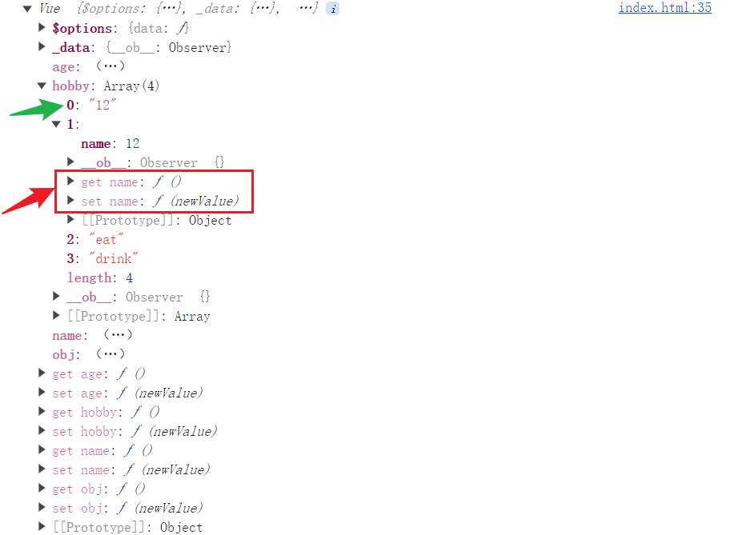

# Vue2 中如何实现响应式数据的监听

## 1、简述

​		Vue 遵循了 MVVM 的设计模式，具体来说就是响应式数据发生变化，视图层会同步更新。那么，Vue 是如何监听到响应式数据的变化的呢？本文以 Vue2 的源码为例，简要的对 Vue 监听响应式数据的原理进行分析，以下代码均为作者根据源码手写，刨除了源码中很多繁杂的代码，较为简要直观。本文只涉及数据的监听，不是完整的响应式原理。

## 2、从 new Vue 说起

​		从源码角度看，所谓 Vue 其实就是一个构造函数，用户传入 Vue 的选项，通过 new Vue 的方式获得 Vue 的实例。所以，我们将打包后的源码挂载到了 global 实例上，命名为 Vue，供用户使用。具体实现是通过 rollup 的配置来实现的

```js
//rollup.config.js
// 默认导出一个对象，作为打包的配置文件
import bable from "rollup-plugin-babel";
export default {
  // 配置打包入口文件
  input: "./src/index.js",
  //   配置打包出口
  output: {
    file: "./dist/vue.js",
    name: "Vue", //将打包之后的对象挂载到 global 上，即新增一个global.Vue
    format: "umd", //esm es6
    sourcemap: true, // 可以调试源代码
  },
  plugins: [
    bable({
      exclude: "node_modules/**", //排除node_modules下的所有文件和文件夹
    }),
  ],
};
```

​		当用户使用 new Vue 时，就会执行源码中的构造函数，构造函数中会进行一系列初始化操作

```js
// index.js
import { initMixin } from "./init"

// Vue 实例的构造函数，options 为用户传入的选项（Vue2 的选项式API）
function Vue(options){
    // 初始化操作
    this._init(options)
}

initMixin(Vue) //将 _init 方法添加到 Vue 实例原型上，供 Vue 实例调用

export default Vue
```

## 3、实现普通对象的监听

### 3.1 获取需要监听的 data 对象

​		经常会有人说，Vue 的 data 是函数，而不是对象。其实这种说法是错误的，在 Vue 2 中，根实例的 data 可以是对象，完全没有任何问题。如下：

```js
new Vue(data:{
        name:'zs',
        age:18
      })
```

​		但是，组件的 data 一定是函数，因为组件最大的特性就是可复用性，我们当然不会希望多处组件共用了同一个 data 实例。

​		所以，对于用户传入的 data 数据，我们需要进行判定。如果 data 是函数，那么我们就执行这个函数，获得 data 对象。

```js
// state.js
import { observe } from "./observe/index"

/**
 * 初始化状态，分发init
 * @param {Object} vm Vue 实例
 */
export function initState(vm) {
    const opts = vm.$options
    // 是否传入data
    if (opts.data) {
        initData(vm)
    }
}

/**
 * 代理对象，非真正的 Proxy
 * @param {Object} vm Vue 实例
 * @param {String} target 要代理的属性
 * @param {String} key target的建
 */
function proxy(vm, target, key) {
    Object.defineProperty(vm, key, {
        get() {
            // 访问 vm[key] 就是在访问 vm._data[key]，即 vm[target][key]
            return vm[target][key]
        },
        set(newValue) {
            vm[target][key] = newValue
        }
    })
}

/**
 * 初始化 data 选项
 * @param {Object} vm Vue 实例
 */

function initData(vm) {
    let data = vm.$options.data
    // 判断 data 的类型，如果是函数，执行它，获得对象。要注意this问题，this应该是Vue实例
    data = typeof data === 'function' ? data.call(vm) : data

    vm._data = data
    // 对数据对象进行劫持
    observe(data)
    // 代理一层，方便用户访问
    for (let key in data) {
        proxy(vm, '_data', key)
    }
}
```

​		获取到 data 对象之后，使用 observe 方法进行数据的监听（劫持）

​		PS：其中的 proxy 方法纯粹是为了方便用户使用而设计的，我们希望用户通过 **Vue 实例 “点” 变量名** 的方式就能获取到对应的数据，所以我们将 Vue 实例的 `_data` 属性通过 defineProperty 做了一层代理，使得用户不必采用 vm._data.变量名 的方式来访问数据，而是通过 vm.变量名的方式就可以访问到。

### 3.2 进行对象的监听

直接附上实现对象监听的关键源码

```js
// observe/index.js
import newProto from "./array"

/**
 * 将传入的 data 对象使用 defineproperty 进行劫持
 * @param {Object} data  要实现响应式的对象
 * @returns {} 
 */
export function observe(data) {


    // 判断 data 是否需要劫持，非对象不劫持
    if (typeof data !== 'object' || typeof data == 'null') {
        return
    }

    // 判断 data 是否已经被监听过了
    if (data.__ob__) return data

    //通过observer类进行监听
    return new Observer(data)
}

class Observer {
    constructor(data) {
        // 把 data 对应的 Observer 实例添加到了 data 上，这样做的话，1 是可以通过监测是否存在_ob_属性来检测 data 是否已被监听过，2 是通过 _ob_ 可以访问到 walk 和 observerArray 以及其他的方法，便于其他地方使用
        // 必须把 _ob_ 设置为不可枚举属性才行，否则在递归遍历监听的时候会死循环
        Object.defineProperty(data, '__ob__', {
            value: this,
            enumerable: false
        })
        // 判断data是否为数组，数组不用进行每一项的劫持
        if (Array.isArray(data)) {
            // 通过修改data的原型，重写可以改变数组的方法
            data.__proto__ = newProto
            this.observerArray(data)
        } else {
            this.walk(data)
        }
    }
    // 遍历对象，进行劫持
    walk(data) {
        Object.keys(data).forEach(key => defineReactive(data, key, data[key]))
    }

    // 实现数组监测
    observerArray(data) {
        //  遍历数组，如果数组的子项是对象的话，要对这个对象进行劫持
        data.forEach(item => observe(item))
    }
}

/**
 * 实现对象指定属性的劫持
 * @param {Object} target 被劫持的对象
 * @param {String} key 需要被劫持的属性
 * @param {*} value 被劫持属性当前的值
 */
export function defineReactive(target, key, value) {
    // 对属性值进行深层递归遍历
    observe(value)
    // 闭包。对外暴露了 set 和 get 方法，从而使 value 值不会被回收
    Object.defineProperty(target, key, {
        // 访问属性的时候，触发get
        get() {
            console.log('get', value);
            return value
        },
        // 修改属性的时候，触发set
        set(newValue) {
            console.log('set', newValue);
            if (newValue === value) return
            // 修改之后重新劫持，因为如果用户将值修改为对象，那么要对这个对象进行深度劫持
            observe(newValue)
            value = newValue
        }
    })
}
```

​		首先，在初始化的时候，调用了 observe 方法，这个方法的主要作用是判断传入的数据是不是对象，如果是对象，那么就调用 new Observer，也就是在遍历对象的同时使用 Object.defineProperty 重新定义对象的**每一个**属性，设置 set 和 get 方法。当我们访问相应对象的属性的时候，就会触发 get 方法，修改属性时，就会触发 set 方法。如果传入的不是对象，那么不用做任何处理，因为 defineProperty 只能劫持对象的属性。在遍历对象的属性时，会对每一个属性再次调用 observe 方法，进行深层的递归遍历。这样就实现了对数据的监听。在 index.html 中进行测试：

```html
// index.html
<!DOCTYPE html>
<html lang="en">
  <head>
    <meta charset="UTF-8" />
    <meta name="viewport" content="width=device-width, initial-scale=1.0" />
    <title>Document</title>
  </head>
  <body>
    <script src="vue.js"></script>
    <script>
      const vm = new Vue({
        data(){
          return {
           name:'zs',
           age:34,
           obj:{
            name:'ls',
            age:122
           }
          }
        }
      })
      console.log(vm); 
      vm.name
      vm.obj.name = 18
    </script>
  </body>
</html>

```

输出结果：


​		可以看到，Vue 为每一个 data 中的对象，以及该对象的每一个属性都添加了 set 和 get 方法，并且在取值和赋值时，能正常触发。

### 3.3 为什么 Observer 是一个类？

关于这个问题，个人的理解是：

​		1、可以通过将相应对象对应的 Observer 实例对象挂载回对象上，从而在进行数据监听处理时，可以通过判断对象上是否存在这个Observer的实例对象，来判断该对象是否已经被监听过。在源码中体现为，将 Observer 类挂载会对象的`__ob__`属性上，然后在observe 方法中对传入的数据进行判断，判断其是否已经含有 `__ob__`属性，从而得知该数据是否已经被监听。当然，这并不是主要原因。

​		2、可以通过`__ob__`这个属性，获取到 Observer 类的 walk 和 observerArray方法。这两个方法可以对传入的对象或数组实现监听。在后续其他地方，比如重写数组的push方法时，需要对新增的数组项实现监听，那么就需要调用 Observer类中的 observerArray 这个方法。通过将 Observer 类实例挂载到 data 上的方式，我们可以在各个地方更轻松的访问到 observerArray 和 walk 方法，而不是使用 import 和 export。

## 4、实现数组的监听

### 4.1 源码分析

​		其实 Vue 完全可以不将数组单独处理，将数组当做普通对象一样处理，完全没有任何问题，也不会出现 “通过数组下标修改数组项，Vue 监听不到” 的这种 bug 了。但是，出于性能考虑，Vue 并没有这样做。原因有二：

​	1、**性能原因**。数组项可能会有很多，对每一项进 defineProperty 的劫持，十分浪费性能。对此尤雨溪的回复是：“通过对每一项进行劫持，用户获取的用户体验，和实际的性能损耗不成正比”。

​	2、**用户很少会通过下标的方式去修改数组项**。数组和对象不同，一般情况下，我们很少通过类似于 `array[888]` 的方式去直接修改数组的某一项。

所以，Vue2 中对数组实现监听的方式是通过重写可能改变数组的 7 个方法来实现的。具体如下：

```js
// observe/index.js
class Observer {
    constructor(data) {
        // 把 data 对应的 Observer 实例添加到了 data 上，这样做的话，1 是可以通过监测是否存在_ob_属性来检测 data 是否已被监听过，2 是通过 _ob_ 可以访问到 walk 和 observerArray 以及其他的方法，便于其他地方使用
        // 必须把 _ob_ 设置为不可枚举属性才行，否则在递归遍历监听的时候会死循环
        Object.defineProperty(data, '__ob__', {
            value: this,
            enumerable: false
        })
        // 判断data是否为数组，数组不用进行每一项的劫持
        if (Array.isArray(data)) {
            // 通过修改data的原型，重写可以改变数组的方法
            data.__proto__ = newProto
            this.observerArray(data)
        } else {
            this.walk(data)
        }
    }
    // 遍历对象，进行劫持
    walk(data) {
        Object.keys(data).forEach(key => defineReactive(data, key, data[key]))
    }

    // 实现数组监测
    observerArray(data) {
        //  遍历数组，如果数组的子项是对象的话，要对这个对象进行劫持
        data.forEach(item => observe(item))
    }
}
```

```js
// observe/array.js
// 重写数组中可以改变数组的7个方法，并返回重写后的原型对象
let oldProto = Array.prototype
// 不可以直接修改数组的原型，通过类似于子类重写的方式，使 newProto 的原型指向原来数组的原型，在 newProto 上重写方法不会影响到原数组原型
let newProto = Object.create(oldProto)

const methods = [
    'push',
    'pop',
    'shift',
    'unshift',
    'reverse',
    'sort',
    'splice'
]

methods.forEach(method => {
    newProto[method] = function (...args) {
        // 调用原有原型上的相同方法，但要注意this问题
        const res = oldProto[method].call(this, ...args)
        // 获取到新增的元素
        let newNode = undefined
        // 对于新增元素的方法，必须给新增的元素添加监听
        if (method === 'push' || method === 'unshift') {
            newNode = args
        } else if (method === 'splice') {
            // spilce 的参数除掉前两个参数之后，才是新增的元素
            newNode = args.slice(2)
        }
		// 监听新添加的元素
        if (newNode) {
            this.__ob__.observerArray(newNode)
        }
        return res
    }

})

export default newProto
```

在 index.html 中进行测试：

```js
      const vm = new Vue({
        data(){
          return {
           name:'zs',
           age:34,
           obj:{
            name:'ls',
            age:122
           },
           hobby:['eat','drink']
          }
        }
      })
      vm.hobby.splice(0,0,'12',{name:'ls'})
      console.log(vm);
```

结果：



​		可见，通过 splice 后新增的数组项中，对象数据被添加了 set 和 get 方法，而非对象元素并没有 set 和 get 方法，也就是并没有被监听。

### 4.2 数组监听的性能瓶颈是因为数组遍历耗费性能吗？

​		有些博客说，vue2 中没有按照处理对象的方式对数组的每一项添加监听的原因是因为遍历长数组很耗费性能。其实 Vue 的性能瓶颈点并不是在于遍历数组，而是为数组的每一项添加 defineproperty 劫持这个操作会耗费大量性能，我们在 observerArray 这个方法中其实可以看到， Vue 对数组的处理其实是进行了遍历的，但是并没有通过遍历 + defineproperty 的方式去进行每项的监听，而是对每项调用 observe 方法，也就是为对象项添加监听。可见对于数组处理的性能瓶颈并不在于遍历，而是为每一项添加 defineproperty 会浪费大量性能，否则完全可以在遍历的时候为每一项调用 defineReactive 方法，而不是 observe。

