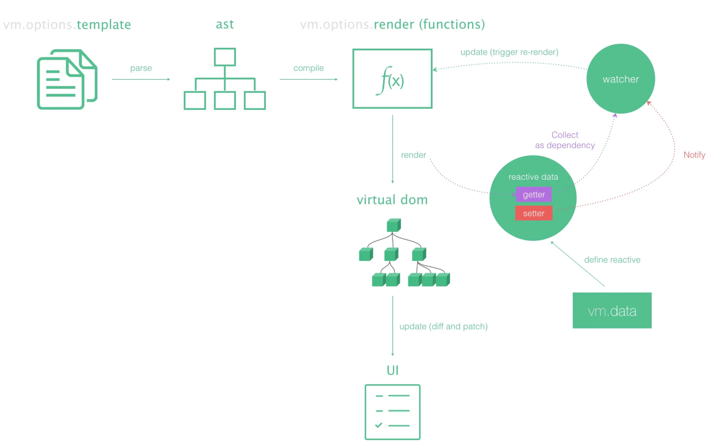

# render 函数和 h 函数

## 1、什么是 render 函数？

我们在使用 Vue 开发的时候，常常选择的是书写模版的方式进行界面的编写，但是 Vue 官方其实还介绍了另一种使用 render 函数的编写方式。比如在 Vue 根实例中直接传入 render 选项：

```js
// Vue2
new Vue({
    data(){},
    render(){
        return createElement("div", {className: "app"}, [
              h("h2", {className: "title"}, "我是标题"),
              h("p", null, "我是内容"),
            ])
        }
	}
})
```

要了解 render 函数的作用，首先得了解 Vue 模版编译的工作原理。简单来说，Vue 会将我们书写的模版，解析为  AST 语法树，再编译为一个 render 函数，执行这个 render 函数，就可以得到模版对应的 Vnode，也就是虚拟 DOM。将所得到虚拟 DOM经过 diff 寻找差异和 patch 打补丁更新后（第一次渲染不用 diff），才会产出真正的 DOM。下图简单明了的说明了 Vue 的核心工作原理：



所以，render 函数，其作用就是产生虚拟 DOM 。如果我们之间书写的是 render 函数，就可以免去模版编译为 render 函数这一步了。

## 2、h 函数

首先要声明的一点是，Vue2 和 Vue3 中的 h 函数，是有些许差异的。h 函数只是一个别名，`h()` 是 **hyperscript** 的简称——意思是“能生成 HTML (超文本标记语言) 的 JavaScript”。这个名字来源于许多虚拟 DOM 实现默认形成的约定。一个更准确的名称应该是 `createVnode()`，但当你需要多次使用渲染函数时，一个简短的名字会更省力（来自 Vue3 官方文档）。

Vue2 中，h 函数是 createElement 函数的别名；Vue 3 中，h 函数是 createVnode 函数的别名。Vue3 修改了 createElement 的名称，因为它实在太容易与元素 JS 的方法混淆了 。

createVnode 和 createElement ，虽然名称不同，但是作用却是相同的，就是用于生成 Vnode。

**h 函数接受三个参数**：第一个参数既可以是一个字符串 (用于原生元素) 也可以是一个 Vue 组件定义。第二个参数是要传递的 prop（属性），第三个参数是子节点。

示例：

```js
h("div", {className: "app"}, [
      h("h2", {className: "title"}, "我是标题"),
      h("p", null, "我是内容"),
    ])
```

得到的返回值是相应结构的虚拟 DOM。

## 3、render 函数的实现

render 函数和 h 函数的作用都是相同的，都是生成 Vnode。其实，render 函数底层就是调用了 h 函数，或者说，render 函数只是对 h 函数的一个简单封装而已，在 **Vue2** 中，我们会将 h 函数作为 render 函数的参数传递进去，然后 render 函数返回 h 函数执行后的结果：

```js
render(h){
    return h('div',{
      //第二个参数
      class:{
        'is-red': true
      }
    },
    //第三个参数  
    [h('p','这是一个render')]
);
```

在 **Vue3** 中，h 函数现在作为全局导入，而不是作为参数传递给渲染函数：

```js
import { h } from "vue"

export default {
  setup() {
    // setup是一个函数, 让这个函数再返回一个函数
    return () => h("div", { class: "app" }, [
      h("h2", { class: "title" }, "我是标题"),
      h("p", null, "我是内容")
    ])
  }
}
```

参考资料：

Vue2 官方文档：[渲染函数 & JSX | Vue.js (vuejs.org)](https://cn.vuejs.org/guide/extras/render-function.html)

Vue3 官方文档：[渲染函数 & JSX — Vue.js (vuejs.org)](https://v2.cn.vuejs.org/v2/guide/render-function.html)


