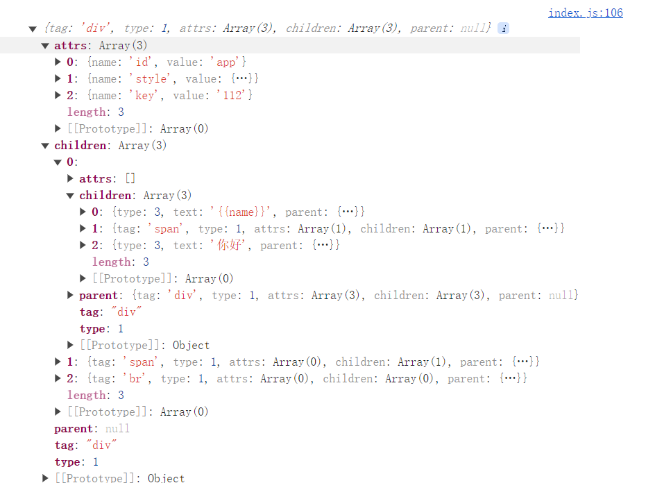
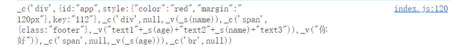
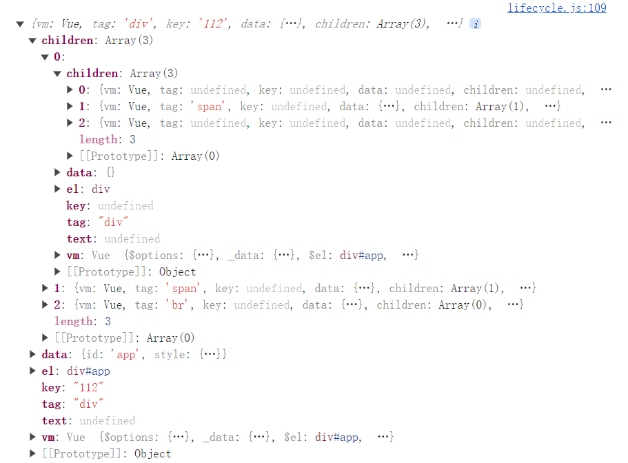

# AST 语法树如何转化为 render 函数

上文讲解了 Vue2 中是如何将模版转化为 AST 语法树的，简单来说就是在解析模版时采用正则匹配，在创建 AST 语法树时采用栈来匹配父子节点。那么在生成了 AST 语法树之后，我们需要根据生成的 AST 语法树，来创建对应的 render 函数，调用这个 render 函数后，我们可以得到模版对应的虚拟 DOM，然后再调用 update 函数（update 内部实际上就是调用了 createElm 函数）来生成真实 DOM，并挂载到相应的节点上。本文主要讨论 AST 语法树转化为 render 函数的过程。 Vue2 核心源码项目链接：[Nwu23787/mini-Vue2: 手写 Vue2 核心源码 (github.com)](https://github.com/Nwu23787/mini-Vue2)

## 1、 基础（new Function + with）

### 1.1 Function

Function 是 JavaScript 中的一个构造函数，一般情况下，我们很少使用 new Function 这种形式去创建一个函数，因为一般我们创建函数时，都已经明确了这个函数的函数体，不需要动态去创建这个函数的函数体。所谓函数体，就是函数的内容。对于 render 而言，不同的模版会生成不同的 render 函数。所以，必须根据模版的不同，动态的创建 render 函数的函数体。这时，就需要采用 new Function 这种形式了。

new Function（）接收多个参数，他的参数是不定项的，都是String类型，最后一个参数需要接收一个字符串，作为函数的函数体内容。

```js
new Function(arg1,arg2,arg3...,str)
```

比如我们想创建一个计算 a+b 的函数

```js
const str = 'return a+b'
const getSum = new Function('a','b',str)
console.log(getSum(1,2)) // 3
```

### 1.2 with

with 也是我们很少使用到的一个 JavaScript 关键字，with 关键字的作用是用来改变作用域的。

如下所示，直接向 a b 取值的话，访问到的是我们在全局作用域中定义的变量

```js
const obj = {
    a: 100,
    b: 'zs'
}

const a = 200
const b = 'ls'
const c = 0

console.log(a); // 200
console.log(b); // ls
```

下面我们使用 with 改变作用域

```js
const obj = {
    a: 100,
    b: 'zs'
}

const a = 200
const b = 'ls'
const c = 0

with (obj) {
    console.log(a); // 100
    console.log(b); // zs
    console.log(c); // 0
}
```

可见，使用 with 后，访问 with 下的所有变量时，都会优先去我们指定的 obj 上寻找，如果在 obj 上没有找到该变量的定义的话，才会向外层继续寻找。这样也导致了我们在访问那些本来不是这个对象的属性的变量时，查找起来将会很慢。

**注：**一般情况下，是非常不建议使用 with 关键字的，就像 C 语言中的 goto 关键字一样。如果过多的使用 with，可能会导致变量混淆和作用域混乱。with 关键字目前已准备逐步被弃用，在 ECMAScript 5 [严格模式](https://developer.mozilla.org/zh-CN/docs/Web/JavaScript/Reference/Strict_mode)中该标签已被禁止。推荐的替代方案是声明一个临时变量来承载你所需要的属性。

## 2、处理不同的 AST 节点

对于不同的 AST 节点，我们会有不同的处理函数，Vue2 中定义了三个函数来进行 AST 节点的处理，将不同类型的 AST 节点转化为虚拟 DOM。

### 2.1 处理元素节点（_c）

Vue2 中定义了 _c 函数，来生成元素节点所对应的虚拟 DOM。其实 _c 函数底层也就是调用了一下 createElement 函数，也就是 h 函数，来生成的虚拟 DOM。

```js
    // 生成 Vnode 节点
    Vue.prototype._c = function () {
        return createElement(this, ...arguments)
    }

	// 创建元素节点的VNode，即 h()
export function createElement(vm, tag, data = {}, ...children) { // Vue 实例，标签名，属性，子节点
    if (data == null) {
        data = {}
    }
    let key = data.key
    if (key) delete data.key
    return vnode(vm, tag, key, data, children)
}

	// 创建 Vnode  的方法
function vnode(vm, tag, key, data, children, text) {
    // 返回创建的虚拟 DOM
    return {
        vm,
        tag,
        key,
        data,
        children,
        text
        // 事件、插槽、指令......
    }
}
```

_c 函数的参数格式为：

```js
_c(标签名,标签上所有属性组成的对象,子节点1，子节点2...)
```

其中子节点是虚拟 DOM 的形式。

### 2.2 处理普通文本节点(_v)

对于普通的文本节点（不含变量），vue2 定义了 _v 函数来生成其对应的虚拟 DOM，`_v` 函数值接收一个参数，就是文本内容，类型为String。`_v` 函数底层是调用了 createTextVNode 函数生成的 VNode，与`_c`异曲同工。参见：

```js
    // 处理文本节点
    Vue.prototype._v = function () {
        return createTextVNode(this, ...arguments)
    }
	
	// 创建文本节点的VNode
	export function createTextVNode(vm, text) {
    	return vnode(vm, undefined, undefined, undefined, undefined, text)
	}
```

### 2.3 处理变量（_s）

对于文本中有变量的情况，我们需要对变量的类型做特殊处理，如果变量是一个对象的话，我们必须将其 JSON 序列化之后再返回他的值。取到变量的值之后，交给处理文本节点的`_v`函数处理。处理变量的函数就是`_s`函数，他只是对变量的类型进行了一个判断，如果是对象的话，就返回 JSON 序列化之后的结果。

```js
    // 处理变量
    Vue.prototype._s = function (name) {
        if (typeof name === 'object') {
            return JSON.stringify(name) // 如果变量是对象，json序列化之后再返回
        }
        return name
    }
```

## 3、根据 AST 语法树生成 render 函数

有了这些函数之后，我们只需要根据 AST 的结构，在 render 函数内去调用相应的函数，就可以得到模版对应的 VNode 了。所以，我们需要根据 AST 语法树的不同，动态的生成 render 函数的函数体。具体来说，就是根据 AST 语法树，来拼接一个字符串，再通过 new Function 的方式，去创建 render 函数；同时使用 wiith 关键字，将 render 函数中变量的取值方向导向 vm 实例（因为变量挂载在 vm 上）。比如，对于这样的html结构：

```html
  <div id="app" style="color:red;margin: 120px;" key="112">
    <div>{{name}} <span class="footer">text1 {{age}} text2 {{name}} text3</span> 你好 </div>
    <span>{{age}}</span>
    <br />
  </div>
```

对应的 AST 语法树结构：



拼接出的 render 函数的函数体：



执行 render 函数后，生成的虚拟 DOM



生成 render 函数的这个过程写的比较杂乱，很难简要的表述出来，下面附上源码。一句话概况，主要就是根据不同的 AST 节点，去拼接字符串，过程并不难，主要是要注意拼接的细节。尤雨溪也曾坦言，当他时写 Vue2 时，对模版编译理解的不够，所以写的比较 low。

附上生成 render 的核心源码，也就是拼接字符串部分：

```js
import { parseHTML } from "./parse"


// 匹配双花括号 {{value}}
const defaultTagRE = /\{\{((?:.|\r?\n)+?)\}\}/g

/* 语法树结构
    元素节点结构
 {
     tag: 'div', // 标签名
     type: 1, // 节点类型：1 元素节点 3 文本节点
     attrs: [{ name: 'id', value: 'app' }], // 属性数组
     parent: null, // 父节点，根节点的父节点wei null
     children: [  // 节点下的子节点
         {}, {}
     ]
 }

    文本节结构
 {
    type: 3,
    text,
    parent: currentParent
 }
 */

// 将 template 模版转化成 AST 语法树

function genProps(attrs) {
    let str = ``
    for (let i = 0; i < attrs.length; i++) {
        let attr = attrs[i]
        if (attr.name === 'style') {
            // 单独处理style属性，因为要将这个属性封装成对象
            let obj = {}
            attr.value.split(';').forEach(item => {
                let [key, value] = item.split(':')
                obj[key] = value
            })
            attr.value = obj
        }
        str += `${attr.name}:${JSON.stringify(attr.value)},`
    }
    return `{${str.slice(0, -1)}}`
}

// 生成某一子节点的字符串参数
const genChild = (item) => {
    if (item.type === 1) {
        // 是元素节点，直接调用codegen生成
        return codegen(item)
    } else {
        // 是文本节点
        // 判断文本里面有没有变量，就是 {{}}
        let text = item.text
        if (!defaultTagRE.test(text)) {
            // 是纯文本节点
            return `_v(${JSON.stringify(text)})`
        } else {
            // 文本中有变量
            let tokens = [] //  保存截取的结果
            let match
            defaultTagRE.lastIndex = 0 // 上面test了，将指针归位
            let lastIndex = 0 // 用于截取非变量文本
            while (match = defaultTagRE.exec(text)) { // exec 方法，遇到满足正则的字符串就返回一次
                let index = match.index
                // 如果这次匹配到结果的开始位置和上一次匹配结束的位置不同，说明这两个位置中间有一个非变量的纯文本
                if (index > lastIndex) {
                    tokens.push(JSON.stringify(text.slice(lastIndex, index)))
                }
                // 匹配变量的结果
                tokens.push(`_s(${match[1].trim()})`) //去掉{{}} 中的空格

                // 移动 lastIndex，保存上一次匹配的最后位置
                lastIndex = index + match[0].length
            }

            // 循环结束之后，还要判断一次有没有剩余的纯文本
            if (lastIndex < text.length) {
                // 说明上一次匹配之后，还剩余了文本，那么这个文本一定不是变量
                tokens.push(JSON.stringify(text.slice(lastIndex)))
            }
            return `_v(${tokens.join('+')})`
        }
    }
}

// 生成所有子节点的字符串参数
const genChildren = (children) => {
    return children.map(item => genChild(item))
}

function codegen(ast) {
    let children = genChildren(ast.children)
    let code = `_c('${ast.tag}',${ast.attrs.length > 0 ? genProps(ast.attrs) : 'null'}${ast.children.length ? `,${children}` : ''})`
    // console.log(code);
    return code
}


// 编译模版，返回render方法
export function compileToFunction(template) {
    // 1. 将 template 模版转化成 AST 语法树
    let ast = parseHTML(template)
    console.log(ast);

    // console.log(ast);
    // 2. 生成 render 方法

    // 目标：把AST语法树组装成下面这样的语法
    // _c 生成元素节点
    // _v 生成文本节点
    // _s 处理变量
    // render(){
    // return _c('div', { id: 'app', style: { "color": 'red' } }, _v(_s(name) + 'hello'), _v('span', null, _v('text1')))
    // }

    let code = codegen(ast)
    console.log(code);

    code = `with(this){
        return ${code}
    }` // 使用 with，改变变量的取值位置，让函数中的变量都向vm上去取值

    let render = new Function(code) // 使用 new Function 生成 render 函数

    return render
}
```

