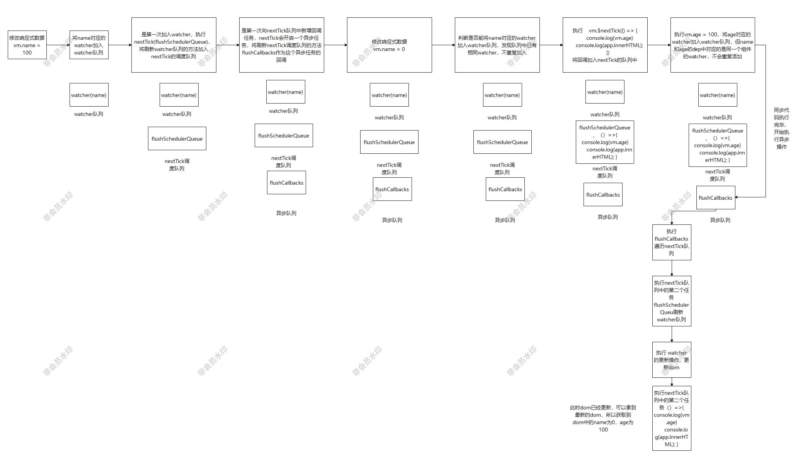

# Vue2 异步更新原理

前面讲解了 Vue2 的依赖收集和视图同步更新原理，当响应式数据发生变化之后， 就会让属性对应的 dep 实例去通知对应的 watcher，对应的 watcher 执行更新方法，立即更新相应的组件。但是这会导致一个非常严重的性能问题，那就是我们每次修改响应式数据，都会发生一次组件的重新渲染。

```js
a = 1000
a = 800
a = 0
```

在这一组代码中，a 变化了三次，那么视图就更新了三次。我们知道 Vue 的视图更新是以组件为粒度的，a 数据发生变化，那么就会导致所有与 a 相关的组件都要重新渲染一次，而此处 a 变化了三次，那么所有与 a 相关的组件都要重新渲染三次，非常浪费性能。其实我们最后希望看到的视图中的 a 只是 0 而已。中间的 1000 和 800，我们的视图并不关心。所以我们需要一种方式，来将所有的更新延迟到当前同步代码执行完毕之后。

## 1、批处理

批处理是 Vue 中很常见的一个策略，他的原理就是将多次任务收集起来，统一进行处理。在实现异步更新时，我们也希望将多次数据变化导致 watcher 执行更新的这个操作收集起来，集中在一次全部更新完。那么首先我们就要收集更新操作，而这个更新操作存在于每一个 watcher 上，那么我们只需要收集执行更新方法的 watcher 即可。

## 2、实现原理

首先，响应式数据发生变化，dep 实例会通知所有的 watcher 去执行 update 方法。对于渲染 watcher，他的 update 方法是：

```js
    // 更新视图
    update() {
        // 把当前的 watcher 暂存在队列中
        queueWatcher(this)
        // this.get()
    }

```

只是调用了 queueWatcher 方法，将需要执行更新操作的 watcher 缓存在调度队列中

```js
// 缓存 watcher 队列
let queue = []
// 去重的辅助对象，源码中没用 set，用的是对象
let has = []
// 防抖
let pending = false

// 刷新 watcher 队列
function flushSchedulerQueue() {
    // 拷贝一份queue，如果在更新的过程中产生了新的 watcher，会加入到 queue 队列中，下一次清空队列时才执行，不会在这一次执行
    let flushQueue = queue.slice(0)
    queue = []
    has = {}
    pending = false
    flushQueue.forEach(item => item.run())
}

function queueWatcher(watcher) {
    // 通过判断watcher的id进行去重，避免同一个组件多次刷新
    const id = watcher.id
    if (!has[id]) {
        // 没有重复
        queue.push(watcher)
        has[id] = true
        // 在第一次加入 watcher 之后，就会将刷新队列的任务加入
        if (!pending) {
            nextTick(flushSchedulerQueue);
            pending = true
        }
    }
}
```

从源码中可以看到，如果是第一次向空队列中加入 watcher，那么会调用 nextTick 函数，并将刷新调度队列的方法 flushSchedulerQueue 作为回调传入 nextTick。我们在上一章说到，nextTick 会将传入的回调加入到 nextTick 的调度队列中，在当前同步代码完成之后，会执行刷新 nextTick 的调度队列的方法，来顺序执行 nextTick 调度队列中的每一个回调。所以，我们将 flushSchedulerQueue 传入 nextTick，其实就是将其延迟到同步代码全部执行完成之后再执行，也就是只有当前所有的同步代码执行完成之后，我们才会去刷新 watcher 队列，执行每一个 watcher 的 DOM 更新方法。

如果还拿上面那个例子来说，a 变化了三次，但这三次都是在同步代码中发生的变化，那么 a 对于的 watcher.update 就执行的三次，而 update 方法其实就是向当前的 watcher 队列中加入 watcher。a 第一次变化时，watcher 队列中没有 a 对应的 watcher，那么就会将 a 对应的 watcher 加入队列。之后 a 发生的两次变化，同样会触发 watcher.update 方法，但此时 a 对应的 watcher 已经在 watcher 队列中了，不会再重复添加（这里判重用的是对象，而不是 set）

##  3、实例

### 实例1：

对于这样一段代码，我们来分析他的底层执行过程：

```js
    // name 初始值18  age 初始值 34
	vm.name = 100
    vm.name = 0
    vm.$nextTick(() => {
      console.log(vm.age)//100
      console.log(app.innerHTML); // 可以拿到更新之后 age 等于100的DOM
    })
    vm.age = 100
```




可以发现，即使 vm.age = 100 是在 nextTick 之后做的，但是 nextTick 的回调还是**能拿到最新的 age 值对应的 DOM**。这是因为在nextTick 前面，我们对 name 的值做了修改，那么就导致刷新 watcher 队列的函数进入了 nextTick 的调度队列中；而后我们又执行了 nextTick 方法，将其中传入的回调加入 nextTick 的调度队列中，在刷新 watcher 队列的方法之后。所以，更新所有 Watcher 的方法会在  `console.log(app.innerHTML)` 之前执行，这样即使我们对 age 的修改在 nextTick 之后，我们依然能在 nextTick 的回调中拿到 age 等于 100 的 DOM。

### 实例2：

```js
   // age 初始值 34
	vm.$nextTick(() => {
      console.log(vm.age)
      console.log(app.innerHTML); // age=34
    })
	vm.age = 100
```

这题中，我们只能拿到 age 为初始值的 DOM，这就意味着，nextTick 中获取 DOM 的操作执行在了更新 DOM 操作之前。我们来分析一下，这题和上一题的最大区别就是，上一题在nextTick之前，修改了 name 的值。**可是修改 name 的值，为什么会对 age 的更新有影响呢？**

首先，Vue 的异步更新原理中，**只有第一次修改响应式数据时，才会将刷新 watcher 队列的方法加入 nextTick 的调度队列中**。对于第一题，我们在 vm.$nextTick 前修改了 name 的值，那么就会将刷新 watcher 队列的方法加入 nextTick 的调度队列，后续我们再执行`vm.$nextTick`时，传入的回调就放在了刷新 watcher 队列的方法的后面，那么我们就可以获取到最新的 DOM 了。

对于第二题，由于`vm.$nextTick`之前没有进行任何变量的修改，那么在执行`vm.$nextTick`的时候，传入的回调就排在了 nextTick 调度队列的首位。后续修改 age 的值，导致刷新 watcher 的队列加入 nextTick，此时会排在我们第一次调用nextTick传入的回调**之后**。也就是说，我们会先执行log，再更新 DOM。自然就获取不到 age 变化后的 DOM 了。

这两题非常的好，对于理解异步更新和 nextTick 的原理大有裨益！

本文共 1730 字（含代码），截止本篇，本系列累计 17963 字


