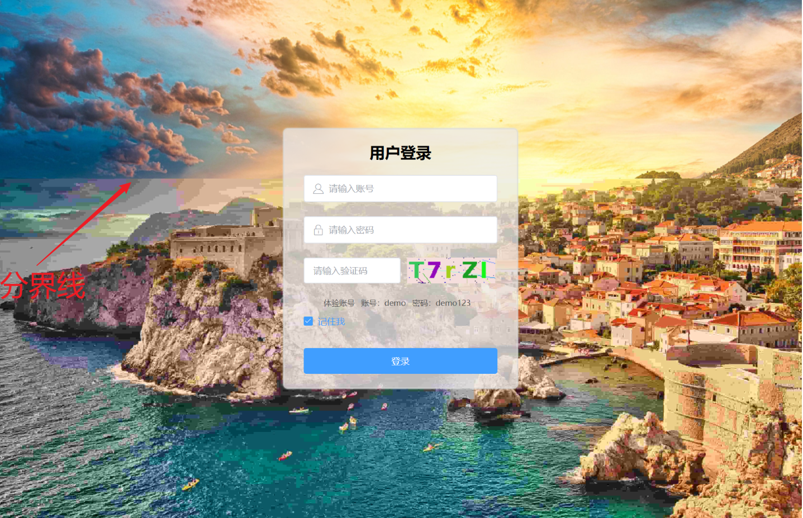

之前在做博客管理端登录页的时候，给登录页的背景图选择了一个体积较大的高清图，上线之后发现加载登录页时，背景图长时间空白，并且大图展示时是从上到下一段一段加载的，用户体验很差。今天下定决心决定对其进行优化了。

## 1. 图片压缩

对于大图的加载，首先考虑到的是压缩。可以通过牺牲小部分图片质量，来换取较好的用户体验。正所谓 “ 图片不压缩，前端要背锅”，这里推荐一个压缩工具 `TinyPng`，它的压缩效果很好，而且带来的图片损失比较小。

## 2. 渐进式图片

什么是渐进式图片？首先我们要知道，一般的图片加载，是从上到下加载的：

加载完成的部分会在上面先展示出来，没加载完成的部分是空白，随着图片的加载，空白部分会被慢慢填充。实际上：没加载出来的部分，**背景并不是空白，而是透明**。

对于渐进式图片，他的加载顺序并不是从上到下的，而是先加载一个模糊的图片，随着图片的加载，慢慢完善图片的细节，最后展示出一个清晰的大图。

很显然，渐进式图片对于用户体验来说，要好很多，用户可以尽早的了解到图片大体内容是什么，而不是长时间面对空白。并且，在弱网环境下，我们甚至可以只下载渐进式图片的一部分，降低分辨率来减少流量。

**将图片转为渐进式有以下几个办法**：

1. jpg 使用 js-mozjpeg，
2. png 使用 worker 将图片按照 Adam7算法([github仓库](https://link.juejin.cn?target=https%3A%2F%2Fgithub.com%2Fchenzeze%2Finterlace-png-with-Adam7%2Fblob%2Fmain%2FAdam7.js))进行拆合来转换
3. 网络图片转换：如果是上传到阿里云oss 的图片，可以通过简单的 RESTful 接口，在任何时间、任何地点、任何互联网设备上对图片进行格式转换和显示控制。其他云服务器也有类似的处理。

## 3. 模拟实现渐进式图片

在做登录页优化的时候，我并没有采用渐进式图片，而是模拟了渐进式图片的效果，也就是图片先模糊后清晰的效果。这也是之前很多网站都在使用的。

模拟渐进式效果主要是利用了普通图片从上到下加载的性质，没加载的部分，背景是透明的，也就是说可以看到下层元素。所以，将模糊图片放在下层，将大图放在上层，这样当大图一点点加载出来的时候，就可以覆盖住模糊小图，达到先模糊后清晰的渐进式效果。

代码：

模糊小图是通过压缩得来的，我将原图压缩为5%得到了模糊小图。原图为1.83MB，而模糊小图的大小仅为 90.7KB，几乎可以做到打开页面，模糊小图就可以立即下载并展示到页面上。之后我们再慢慢等待大图下载，大图每下载一部分，都会遮住小图相应的部分，看上去就像是小图的那部分变清晰了。用户体验 UP ！

**效果图：**

可以明显看到，分界线上面部分是已经加载完的大图，而下半部分的大图还没有加载完，仍然展示的是模糊小图。

